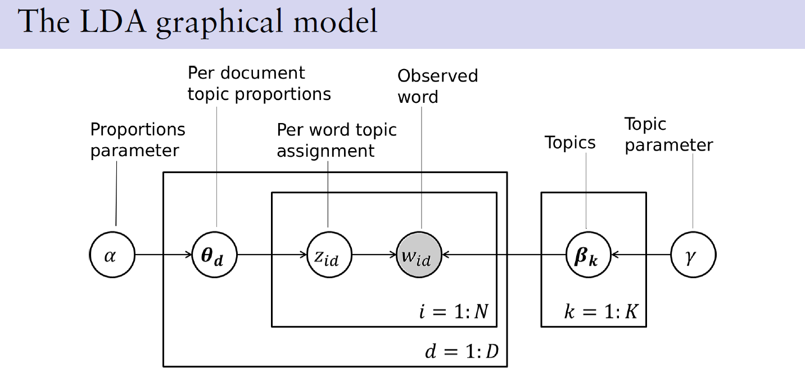
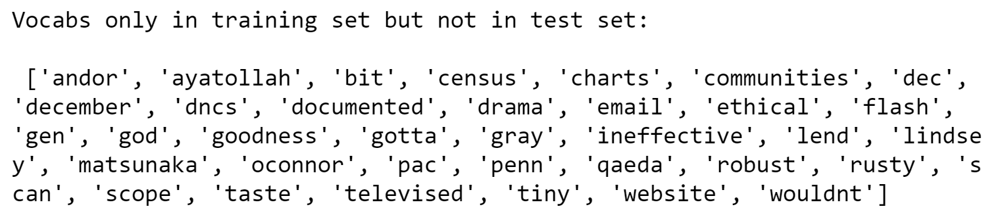
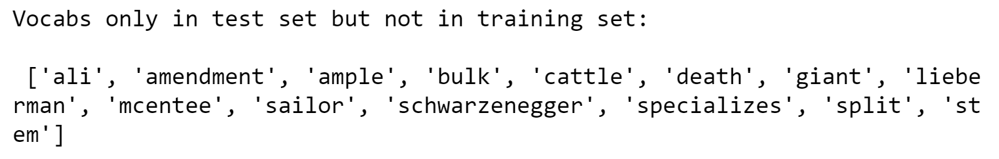

# Document categorisation system based on LDA

  

Shown above are an enormous collection of documents to be automatically categorised into merely **20 topics**. For simplicity, categorisation is only based on the **frequency** at which each of the available 6906 vocabs appears in each document, i.e. vocab count, instead of the appearing sequence of the vocabs. A generative model for each word in a document was to be built, and it was designed that __which vocab each word takes__ depends on **the multiple topics that particular document belong to**. The remaining sections of this `README` give an overview of the beneficial features of using an LDA model.

  

  

  

  

