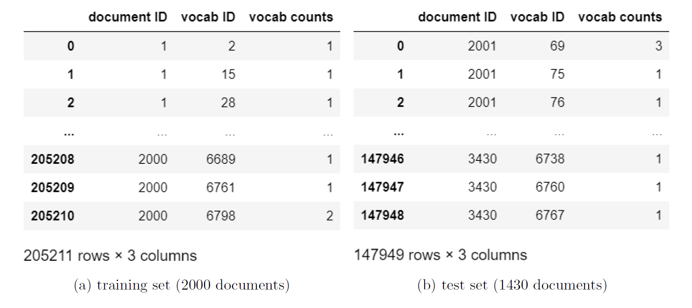
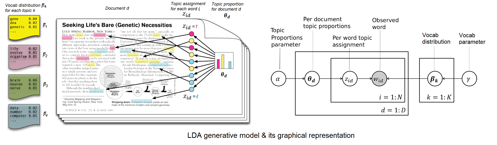
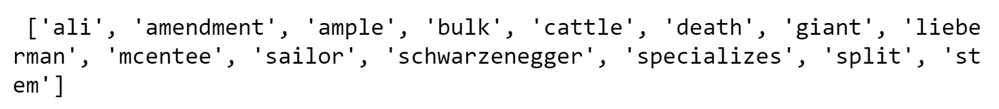

# Document categorisation system based on LDA

  

Shown above are an enormous collection of documents to be automatically categorised into merely **20 topics**. For simplicity, categorisation is only based on the **frequency** at which each of the available 6906 vocabs appears in each document, i.e. vocab count, instead of the appearing sequence of the vocabs. A generative model for each word in a document was to be built, and it was designed that __which vocab each word takes__ depends on **the multiple topics that particular document belong to**. The remaining sections of this `README.md` give an overview of the beneficial features of using an LDA model.

  

---

First problem LDA is able to address is the inevitable situation that **when a trained categorisatoin system is put into use, it will inevitably encounter vocabs which have never been seen before**, just like some vocabs in the test set were absent in the training set:

  

LDA takes this situation into account by introducing "**pseudo-counts**" γ to all vocabs **including the unseen ones**. In this way the unseen vocabs were "virtually seen" during training, giving the generative model the capability to generate these unseen vocabs when put in use.

---

In order to categorise documents into different topics, documents belonging to different topics should be generated differently by the model. In the light of this, LDA possesses **a unique vocab distribution β for each topic**. Moreover, since a document doesn't necessarily belong to only one single topic, LDA assigns **a unique topic proportion θ to each document**. In effect, different words in the same document can belong to differnt topics.

---

*Demo above is part of my university coursework. Details of problem statements and analysis can be found in `Problems.pdf` and `Report.pdf` respectively, while details of the LDA model can be found in the `theories` folder.*
